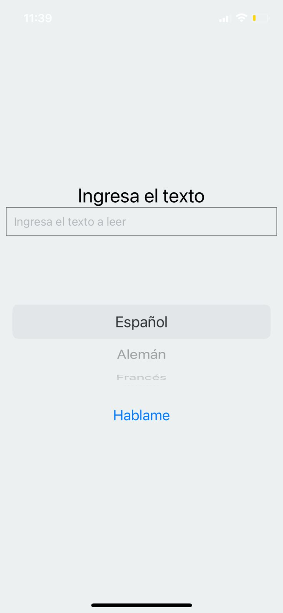

Realizar una aplicación que hable y que reproduzca el texto que previamente se ha escrito.
El resultado final va a tener un cuadro de texto donde podamos escribir el texto que diga el móvil y un botón, que al pulsarlo nos diga lo que se ha escrito.
Además, se va a incluir la posibilidad de que el texto lo pronuncie con un acento determinado de entre los siguientes: español, alemán, francés, inglés e italiano.
Por último, si movemos el dispositivo, este nos hablará y nos dirá algo como "deja de moverme".

